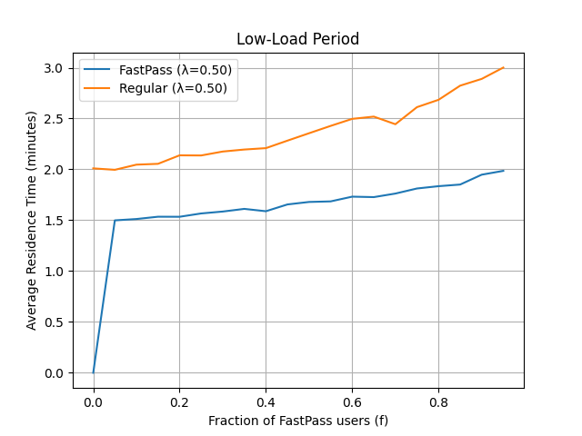
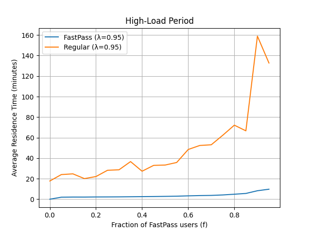

# priority-queue-model

## 🎢 FastPass+ Queue Simulation 

This project simulates a two-class priority queueing system inspired by Disney's retired **FastPass+** system. Built using discrete-event simulation in Python, the model evaluates how allocating FastPasses impacts the wait times for both FastPass holders and regular guests under varying levels of theme park activity.

It was developed as part of the **Simulation & Stochastic Modeling** course at **Rollins College**.

## 📚 Background: What is FastPass+?

FastPass+ was a virtual queueing system used at Disney parks (1999-2021) that allowed guests to reserve time slots for attractions and skip the standard queue. From a simulation perspective, this create a **priority queue**, where: 

- 🎟️ **FastPass holders:** Higher priority; skip ahead of the regular line.
- 🚶🏻‍♀️ **Regular guests:** Lower priority; wait in full queue and are often preempted.

This model helps answer:
👉🏼 *What is the optimal proportion of FastPasses (`f`) to issue without degrading the experience for either group?*

## 🧠 What this simulation does

- Models a ride as an **M/M/1** system with: **exponential interarrival and service times**, two customer **classes** (FastPass and regular)
- Simulates arrivals, waiting, and service dynamics
- Varies the FastPass allocation fraction `f` from 0 to 0.95
- Tracks average residence (waiting + service) times for each group
- Repeats the analysis under: Low-load conditions where `𝜆` = 0.50, High-load conditions where `𝜆` = 0.95

## ⚙️ Requirements

- Python 3.7 or higher
- No external libraries required (uses only Python standard lobrary and `matplotlib` if plotting is enabled)

## 🚀 How to run

1. Clone the repository

<pre>
git clone https://github.com/stellafruijtier/priority-queue-modeling.git
cd priority-queue-modeling
</pre>

2. Run the simulation

<pre>
python3 FastPassSimulation.py
</pre>

This will:
- Run simulations for a range of `f` values (fraction of FastPass users)
- Compute average residence times for both classes
- Plot graphs of performance vs. `f`

## 🧩 Available parameters: 

| Parameter         | Description                                                | Example Value |
|------------------|------------------------------------------------------------|----------------|
| `λ` (`lambda`)   | Total arrival rate (guests per minute)                     | `0.95` or `0.50` |
| `μ` (`mu`)       | Service rate (guests served per minute)                    | `1.0` |
| `f`              | Fraction of arrivals that are FastPass users               | `0.0` to `0.95` |
| `SIM_TIME`       | Duration of the simulation in virtual time units (minutes) | `100000` |
| `RANDOM_SEED`    | Seed for reproducibility (optional)                        | `42` |

Note: All parameters are currently set directly in the code. You can modify them by editing `FastPassSimulation.py`.

## 📈 Sample output

<pre>
HIGH-LOAD RESULTS (λ=0.95):
f = 0.00: FastPass time = N/A, Regular time = 21.67 min
f = 0.05: FastPass time = 1.99, Regular time = 19.90 min
f = 0.10: FastPass time = 2.04, Regular time = 19.05 min
f = 0.15: FastPass time = 2.10, Regular time = 23.76 min
f = 0.20: FastPass time = 2.19, Regular time = 23.70 min
f = 0.25: FastPass time = 2.22, Regular time = 27.63 min
f = 0.30: FastPass time = 2.36, Regular time = 30.25 min
f = 0.35: FastPass time = 2.46, Regular time = 30.73 min
f = 0.40: FastPass time = 2.57, Regular time = 33.59 min
f = 0.45: FastPass time = 2.65, Regular time = 40.28 min
f = 0.50: FastPass time = 2.82, Regular time = 28.67 min
f = 0.55: FastPass time = 2.94, Regular time = 37.38 min
f = 0.60: FastPass time = 3.20, Regular time = 41.74 min
f = 0.65: FastPass time = 3.45, Regular time = 57.10 min
f = 0.70: FastPass time = 3.75, Regular time = 50.05 min
f = 0.75: FastPass time = 4.32, Regular time = 63.31 min
f = 0.80: FastPass time = 4.92, Regular time = 74.89 min
f = 0.85: FastPass time = 6.34, Regular time = 111.10 min
f = 0.90: FastPass time = 7.25, Regular time = 88.33 min
f = 0.95: FastPass time = 10.65, Regular time = 258.56 min

LOW-LOAD RESULTS (λ=0.50):
f = 0.00: FastPass time = N/A, Regular time = 1.98 min
f = 0.05: FastPass time = 1.46, Regular time = 2.02 min
f = 0.10: FastPass time = 1.55, Regular time = 2.12 min
f = 0.15: FastPass time = 1.55, Regular time = 2.08 min
f = 0.20: FastPass time = 1.56, Regular time = 2.12 min
f = 0.25: FastPass time = 1.59, Regular time = 2.16 min
f = 0.30: FastPass time = 1.57, Regular time = 2.14 min
f = 0.35: FastPass time = 1.61, Regular time = 2.21 min
f = 0.40: FastPass time = 1.63, Regular time = 2.24 min
f = 0.45: FastPass time = 1.67, Regular time = 2.39 min
f = 0.50: FastPass time = 1.67, Regular time = 2.39 min
f = 0.55: FastPass time = 1.67, Regular time = 2.37 min
f = 0.60: FastPass time = 1.71, Regular time = 2.43 min
f = 0.65: FastPass time = 1.73, Regular time = 2.48 min
f = 0.70: FastPass time = 1.78, Regular time = 2.60 min
f = 0.75: FastPass time = 1.81, Regular time = 2.56 min
f = 0.80: FastPass time = 1.86, Regular time = 2.71 min
f = 0.85: FastPass time = 1.89, Regular time = 2.66 min
f = 0.90: FastPass time = 1.90, Regular time = 2.97 min
f = 0.95: FastPass time = 1.90, Regular time = 2.86 min

RECOMMENDED FASTPASS ALLOCATIONS:
High-Load (λ=0.95): 0.20 or 20% FastPasses
Low-Load (λ=0.50): 0.60 or 60% FastPasses

RESULTS:
High-Load: At f=0.20, FastPass time = 2.19 min, Regular time = 23.70 min

FastPass benefit: 19.48 min faster than baseline (21.67 min)

Regular penalty: 2.03 min slower than baseline
Low-Load: At f=0.60, FastPass time = 1.71 min, Regular time = 2.43 min

FastPass benefit: 0.27 min faster than baseline (1.98 min)

Regular penalty: 0.44 min slower than baseline
</pre>

### Low-Load Period (`𝜆` = 0.50) results graph

### High-Load Period (`𝜆` = 0.95) results graph

## 🔍 Summary of insights

- Too many FastPasses : Long waits for regular guests
- Too few FastPasses : Underutilization of virtual queuing benefits
- Simulation helps determine a **"sweet spot"** for each activity level

## 🧪 Key Concepts reinforced

- Discrete-event simulation & event queue management
- **Priority-based M/M/1** queueing systems
- Virtual queueing vs. traditional queueing
- Empirical analysis of residence times
- Parameter tuning for service design

## 📖 Acknowledgments

This simulation is based on a project prompt by Dan Myers, whose teaching in simulation and modeling at **Rollins College** inspired this work.
